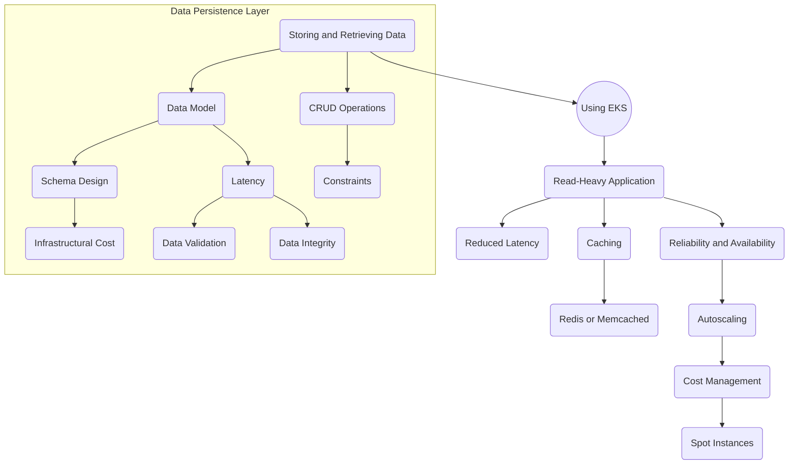

```mermaid
graph TD

subgraph Data Persistence Layer
  A(Storing and Retrieving Data)
  B(CRUD Operations)
  C(Data Model)
  D(Schema Design)
  E(Latency)
  F(Infrastructural Cost)
  G(Data Validation)
  H(Data Integrity)
  I(Constraints)
end

A --> B
A --> C
B --> I
C --> D
C --> E
D --> F
E --> G
E --> H

A --> J
J((Using EKS))
J --> K(Read-Heavy Application)
K --> L(Caching)
L --> M(Redis or Memcached)
K --> N(Reduced Latency)
K --> O(Reliability and Availability)
O --> P(Autoscaling)
P --> Q(Cost Management)
Q --> R(Spot Instances)

```